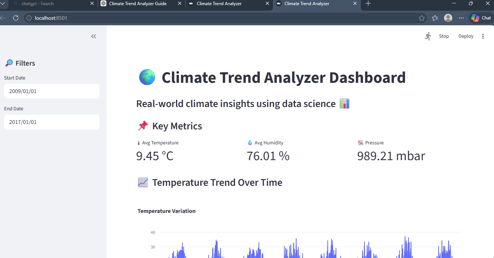
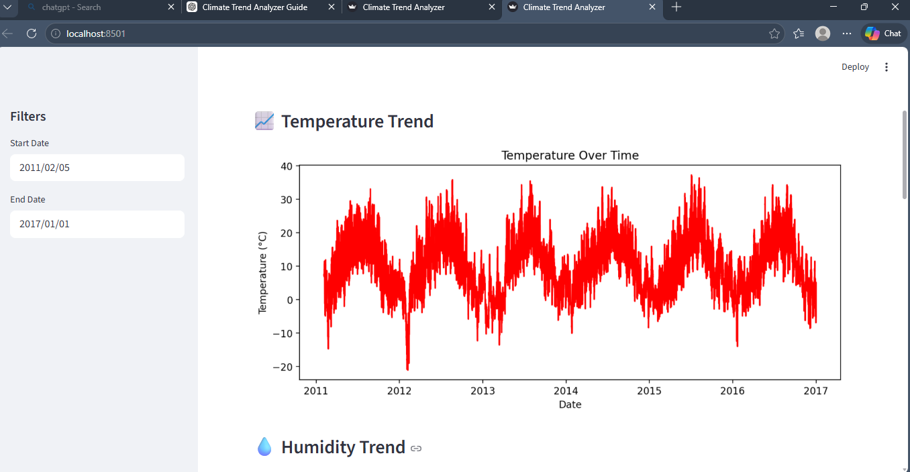
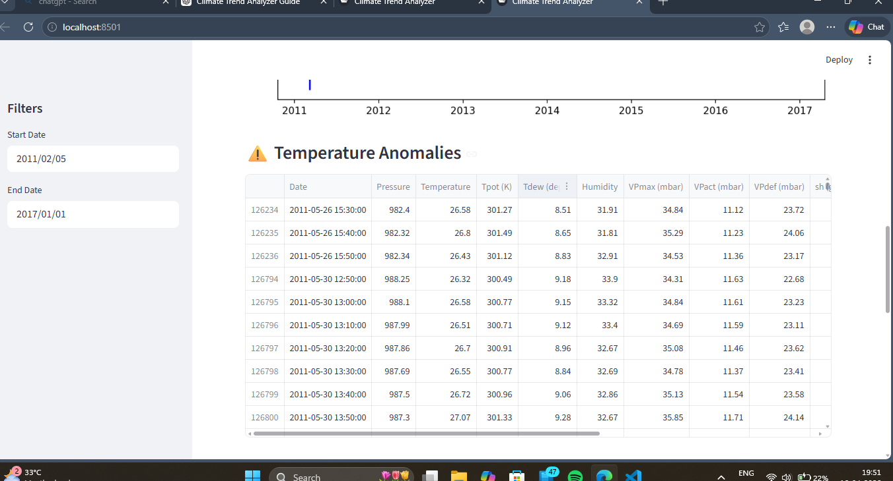
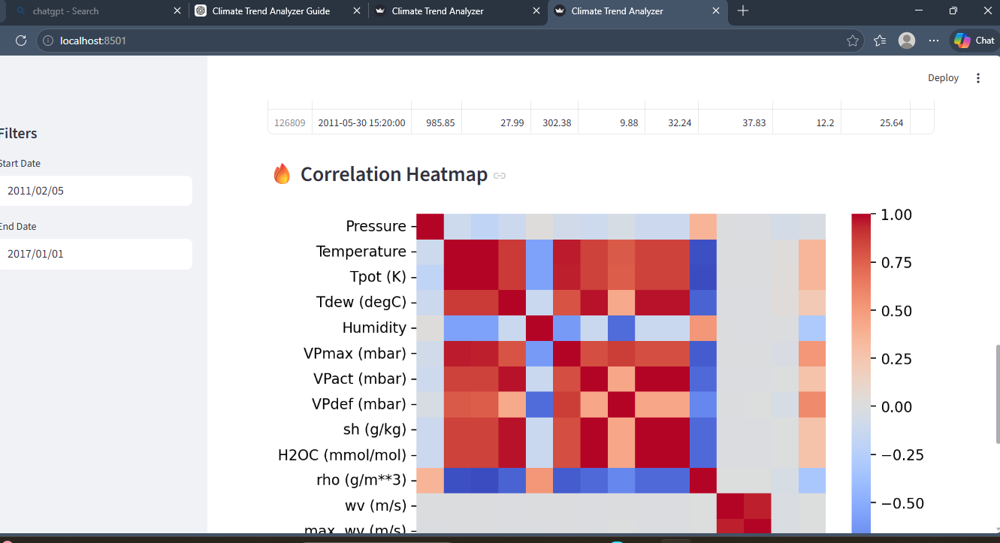
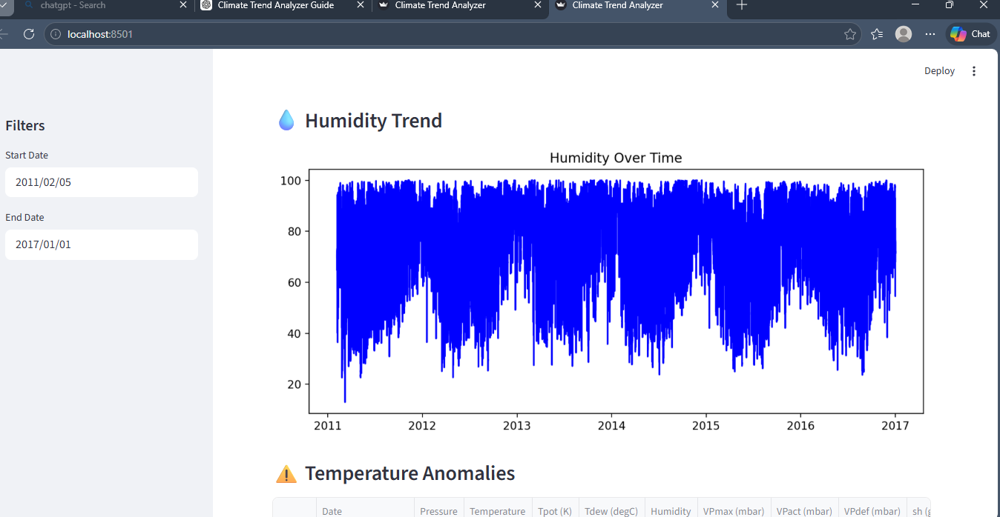

🌍 CLIMATE TREND ANALYZER
A. PROJECT EXPLANATION
🌱 What is a Climate Trend Analyzer?
👉 Simple Language

A Climate Trend Analyzer is a data science project that studies weather data like:

temperature 🌡️
rainfall 🌧️
CO₂ levels 🌫️
humidity 💧

It helps us understand:

Is the Earth getting hotter?
Is rainfall changing?
Are there unusual climate patterns?
👉 Technical Definition

A Climate Trend Analyzer is a time-series data analysis system that applies:

statistical analysis
exploratory data analysis (EDA)
anomaly detection
forecasting models

to identify long-term environmental patterns and climate variability trends.

🌍 Real-World Problem It Solves

Climate data is complex and large. This project helps to:

detect global warming trends 🌡️
identify rainfall irregularities 🌧️
detect anomalies (heatwaves, drought signals)
forecast future climate conditions
support climate decision-making
🏢 Industry Usage

Used by:

NASA 🌌
NOAA 🌊
UN Climate Programs 🌍
Google Earth Engine
Insurance companies
Agriculture analytics firms
📊 Workflow Overview
Climate Data Collection
Data Cleaning
Exploratory Data Analysis (EDA)
Feature Engineering
Trend Analysis
Anomaly Detection
Forecasting (optional)
Visualization
Insights & Reporting
B. PROJECT ARCHITECTURE
🧠 System Flow


        ┌──────────────┐
        │ Climate Data │
        └──────┬───────┘
               ↓
     ┌──────────────────┐
     │ Data Cleaning    │
     └──────┬───────────┘
            ↓
     ┌──────────────────┐
     │ EDA & Analysis   │
     └──────┬───────────┘
            ↓
     ┌──────────────────┐
     │ Trend Analysis   │
     └──────┬───────────┘
            ↓
     ┌──────────────────┐
     │ Anomaly Detection│
     └──────┬───────────┘
            ↓
     ┌──────────────────┐
     │ Visualization    │
     └──────────────────┘
     
     
🧩 Modules
data loader
preprocessing module
analysis engine
anomaly detector
visualization engine
D. IMPLEMENTATION PLAN (PHASES)
Phase 1 — Setup
Install Python, libraries
Create project folder

✔ Output: working environment

Phase 2 — Dataset Setup
Load CSV (Kaggle / synthetic)
Inspect structure

✔ Output: raw dataset preview

Phase 3 — Cleaning
Remove nulls
Fix dates
Remove outliers

✔ Output: cleaned dataset

Phase 4 — EDA
Graphs
summary stats

✔ Output: insights graphs

Phase 5 — Trend Analysis
rolling averages
yearly trends

✔ Output: climate trend line

Phase 6 — Anomaly Detection
statistical threshold method

✔ Output: anomaly points

Phase 7 — Visualization
heatmaps
line charts
seasonal graphs

✔ Output: dashboard visuals

Phase 8 — GitHub Upload
README
screenshots
code upload
E. FOLDER STRUCTURE
Climate-Trend-Analyzer/
│
├── data/
│   └── climate_data.csv
│
├── notebooks/
│   └── climate_analysis.ipynb
│
├── src/
│   ├── data_cleaning.py
│   ├── eda.py
│   ├── trend_analysis.py
│   ├── anomaly_detection.py
│
├── outputs/
│   ├── graphs/
│   ├── reports/
│
├── images/
│
├── app/
│   └── streamlit_app.py
│
├── requirements.txt
├── README.md
└── main.py
F. INSTALLATION STEPS
Windows
pip install pandas numpy matplotlib seaborn scikit-learn plotly statsmodels
Mac/Linux
pip3 install pandas numpy matplotlib seaborn scikit-learn plotly statsmodels
Virtual Environment
python -m venv env
env\Scripts\activate   # Windows
source env/bin/activate # Mac/Linux
G. FULL WORKING CODE
📁 File: data_cleaning.py
import pandas as pd

def load_data(path):
    df = pd.read_csv(path)
    return df

def clean_data(df):
    df = df.dropna()
    df['Date'] = pd.to_datetime(df['Date'])
    df = df.sort_values('Date')
    return df
📁 File: eda.py
import matplotlib.pyplot as plt

def plot_temperature(df):
    plt.plot(df['Date'], df['Temperature'])
    plt.title("Temperature Trend")
    plt.show()
📁 File: anomaly_detection.py
def detect_anomalies(df):
    mean = df['Temperature'].mean()
    std = df['Temperature'].std()

    df['anomaly'] = abs(df['Temperature'] - mean) > 2 * std
    return df
📁 File: trend_analysis.py
def rolling_average(df):
    df['rolling'] = df['Temperature'].rolling(12).mean()
    return df
📁 File: main.py
from src.data_cleaning import load_data, clean_data
from src.eda import plot_temperature
from src.anomaly_detection import detect_anomalies

df = load_data("data/climate_data.csv")
df = clean_data(df)

df = detect_anomalies(df)
plot_temperature(df)
H. VIRTUAL SIMULATION WORKFLOW
Step 1

Create synthetic dataset:

date range (2000–2025)
temperature values
Step 2

Add noise:

random spikes
seasonal variation
Step 3

Load into Python

Step 4

Clean dataset

Step 5

Run analysis

Step 6

Generate graphs

## 🚀 Features
- 📊 Climate Data Analysis
- 📈 Temperature & Humidity Trends
- 🔥 Correlation Analysis
- ⚠️ Anomaly Detection
- 🔮 Future Temperature Forecasting
- 🌐 Interactive Streamlit Dashboard

## 🛠 Tech Stack
- Python
- Pandas, NumPy
- Matplotlib, Seaborn, Plotly
- Scikit-learn
- Streamlit
## 📂 Folder Structure


Climate-Trend-Analyzer/
│
├── app/ # Streamlit dashboard
├── data/ # Raw dataset
├── src/ # Data processing scripts
├── outputs/ # Processed data & results
├── images/ # Screenshots for README
├── notebooks/ # Jupyter analysis
├── requirements.txt # Dependencies
├── .gitignore
└── README.md

---

## ⚙️ Installation

```bash
git clone https://github.com/Tejaswini747/climate-trend-analyzer.git
cd climate-trend-analyzer

python -m venv venv
venv\Scripts\activate

pip install -r requirements.txt
streamlit run app/app.py
Open in browser:

http://localhost:8501
## 📊 Project Screenshots

### 🌍 Dashboard Overview


---

### 📈 Temperature Trend


---

### ⚠️ Anomaly Detection


---

### 🔥 Correlation Heatmap


---

### 💧 Humidity Trend

